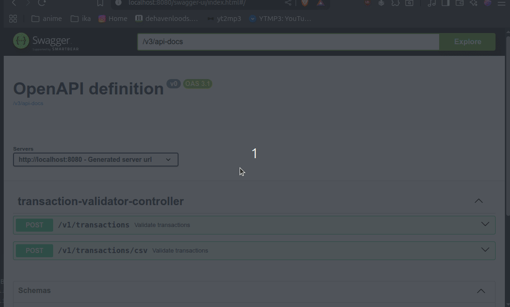

# Transaction Validator
Gets a list of transactions and validates whether  transaction numbers are duplicated and balances are ok per record.
## Installation
### Compile
``` mvn clean package```
### Run
``` java -jar target/transaction-validator-0.0.1-SNAPSHOT.jar```
## Assumptions and Constraints
- Input files are either in CSV or JSON format.
- Response is generated in HTML or JSON format.
- Input files are small enough to be processed in memory. (50MB max)
- Swagger UI is used for testing the API but on small files only.
- For ```10MB``` + files preferable use CURL or another tooling to call the API
- A file under ```src/test/resources``` called ```records-fat.csv``` can be used to test performance with larger files.
- Example CURL command:
  ```curl -X 'POST'   'http://localhost:8080/v1/transactions/csv'   -H 'accept: text/html'   -H 'Content-Type: multipart/form-data'   -F 'file=@transactions_1GB.csv;type=text/csv'>result.html```

### Improvements
- To handle larger files streaming on html and json responses can be implemented (via consumer).
- Add authentication and authorization.
## Demo
### From Json

### From CSV

